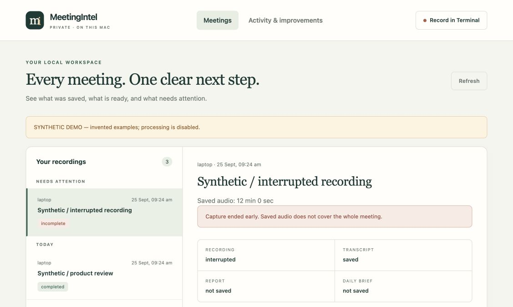
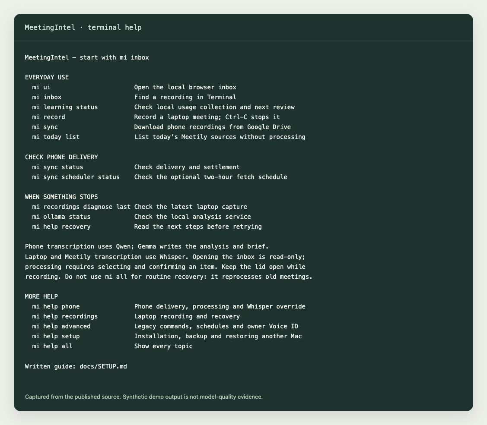

# MeetingIntel

I built this because recording a meeting was easy. Reliably getting from the recording to something I could use was much harder.

MeetingIntel records on a Mac, brings in phone recordings, transcribes them locally and turns them into a detailed report and a shorter daily brief. The inbox shows what actually exists at each step, so a saved recording does not get confused with a finished report.

**The application source and Voice ID module are now here, as an early public release.** The small demos below run without models or accounts. Setting up real transcription and recording still takes work; this is a contributor release, not a one-click Mac app.



*Actual UI, synthetic examples. The screenshot is from `demo_ui.py`; processing is disabled in that demo.*

## Try it in a few minutes

Python 3.11 on macOS or Linux is enough for these demos. Windows support has not been established.

```sh
git clone https://github.com/St-Gonne/meeting-intelligence-system.git
cd meeting-intelligence-system
python3.11 app/mi help
python3.11 app/demo_ui.py
```

The second command opens the real inbox with invented recordings. It does not inspect your meetings, record audio, start a model or install a service. Press Ctrl-C to stop it.

Try the separate Voice ID lifecycle:

```sh
python3.11 app/demo_voice_id.py
```

This exercises enrollment, a candidate match, per-meeting confirmation, separate retention consent and revocation using invented vectors. It proves the state transitions; it is **not an accuracy demonstration**. [Voice ID module and API →](docs/VOICE_ID.md)

## What is included

| Part | What it does | Current limit |
|---|---|---|
| Local inbox | Shows recordings, transcripts, reports and briefs separately; selects one source for processing | Loopback browser UI, not a hosted service |
| Terminal workflow | Guided inbox, capture, phone delivery, diagnosis and recovery | macOS capture needs OBS and permissions |
| Transcription | Qwen phone path, Whisper laptop/Meetily path, diarization and provenance | Optional model environments need manual setup |
| Analysis | Detailed report, short brief, context and output validation | Pinned local Ollama baseline; no universal accuracy claim |
| Capture guard | Watches recording health, preserves available segments, reports interruption | Closing the lid can lose audio; recovery cannot recreate it |
| Voice ID | Local owner matching with explicit review, retention and deletion | Owner-only 1:1 use; no automatic naming or group-call claim |
| GPU coordination | Serializes heavy jobs and checks cleanup before handover | Current two-service setup is opinionated; broader portability needs work |
| Local usage review | Records content-free operation events and proposes improvements | Does not read meeting content or change the software itself |

Code is in [`app/`](app/). The [source manifest](docs/SOURCE_MANIFEST.json) describes the extraction. Recordings, transcripts, meeting outputs, credentials, voice enrollments, private calibration reports and model weights are excluded.

## Using the terminal

After following [real-runtime setup](docs/SETUP.md), run `python3.11 app/mi …`, or add `app/` to your PATH and use `mi …`:

```sh
mi ui                        # Open your local inbox
mi inbox                     # Guided selection in the terminal
mi record                    # Start guarded laptop capture; Ctrl-C stops it
mi sync                      # Fetch configured phone recordings; no processing
mi sync status               # Check delivery and settlement
mi today list                # List today's Meetily sources without processing
mi recordings diagnose last  # Inspect the last laptop capture
mi ollama status             # Check the local analysis service
mi voice status              # Inspect separately configured owner Voice ID
mi voice review last         # Explicit audio consent, then confirm any match
mi learning status           # Check local usage collection
mi help recovery             # Recovery guidance before retrying
```

`mi sync` needs your own separately configured Drive authorization. Delivery, grouping and processing are distinct steps. The phone lane accepts in-person recordings; it does not capture cellular or VoIP calls. Opening the inbox is read-only. Do not use `mi all` as a routine retry command.



## What using it has taught me

A file can keep growing while the recording contains silence. A perfectly good transcript can cover only half a meeting. A speaker label tells you that a voice changed; it does not tell you who spoke. A faster model is not an improvement if it loses names, switches languages incorrectly or invents who agreed to do something.

Those failures shaped the current code: capture manifests and checksums, visible interruption states, exact source selection, separate saved-stage status, explicit identity review and strict model-output checks. [Problems, fixes and remaining gaps →](docs/USAGE_LEARNINGS.md)

## Where help would make a difference

- Measure time and peak memory by stage before trying to make the whole pipeline faster.
- Build a consented Hindi-English evaluation set that measures names, numbers, overlap and missed speech, not just a nice-looking transcript.
- Make local model setup and shared-memory handling easier across Macs without weakening admission and cleanup checks.
- Improve Voice ID calibration for a new owner, including reliable rejection of unknown speakers.
- Try the clean setup on a second machine and turn failures into reproducible fixes.

[Open contributor issues](https://github.com/St-Gonne/meeting-intelligence-system/issues) · [Contributing](CONTRIBUTING.md) · [Setup](docs/SETUP.md)

If you want to help, pick one measured problem. A small PR with a synthetic reproduction is easier to review than a new framework. If you use this, a star helps other people find it; if you fork it, tell us what worked and what broke.

## Tests and terms

```sh
python3.11 -m venv .venv
.venv/bin/python -m pip install -r requirements-test.txt
.venv/bin/python scripts/test_public.py
```

Tests run in isolated temporary homes and use synthetic fixtures or fake model servers. Passing them does not establish live capture or model quality on your hardware. See [release validation](docs/RELEASE_VALIDATION.md).

MeetingIntel application code, including Voice ID, and its accompanying developer docs use the [MIT License](app/LICENSE.md). You can use, modify and redistribute them, including in commercial products. Older architecture documents retain their existing terms; see [license scope](LICENSE.md). Third-party dependencies and model weights have their own licenses. The separate [phone-ingestion toolkit](https://github.com/St-Gonne/meetingintel-phone-ingest) remains Apache-2.0.
