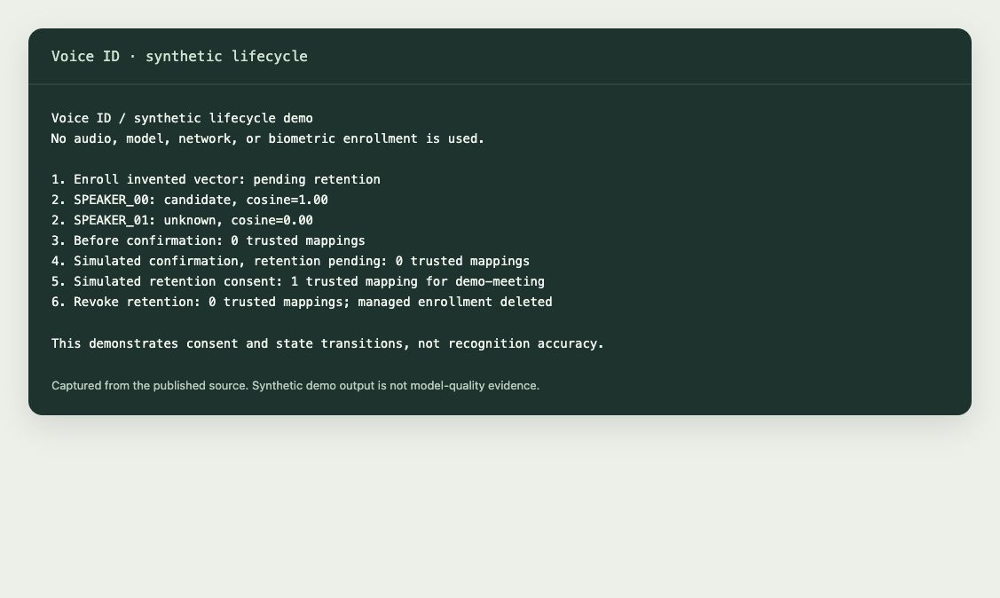

# Voice ID: a suggestion you review

Diarization answers “which voice spoke when?” Voice ID asks whether a voice matches an enrolled person. Those are different problems, and a confident label can still be wrong.

The module is now published in [`app/`](../app/). It can be used without the MeetingIntel UI. The private owner workflow has been used on a reviewed 1:1 phone meeting; that is practical evidence for one owner, not a population-level accuracy result.

## Run the lifecycle demo

```sh
python3.11 app/demo_voice_id.py
```



*Terminal output rendered from a real demo run. Vectors and calibration are invented; no voice or model is used.*

The demo enrolls an invented vector, leaves a second speaker unknown, confirms the candidate for one meeting, separately grants retention, then revokes it. All temporary state is removed when it exits.

## Reuse the code

| Module | Responsibility |
|---|---|
| `voiceprint_synthetic_candidate.py` | Cosine candidates, enrollment state, pending expiry and deletion |
| `voiceprint_gate5_inbox.py` | Per-meeting review tokens, confirmation, provenance and trusted maps |
| `voiceprint_gate5_audio.py` | Explicit consent and local audio/model validation before an embedding call |
| `voiceprint_provider_pyannote.py` | Optional local embedding adapter |
| `voiceprint_provider_speechbrain.py` | Optional alternative evaluation adapter |
| `voiceprint_owner_bakeoff.py` | Local evaluation and calibration harness |
| `voiceprint_gate5_preview.py` | Preview against an already diarized supported phone source |
| `meetingintel_voice_cli.py` | Owner-only `mi voice` workflow |

`demo_voice_id.py` is a small complete API example. For real audio, pass `model_asset=Path(...)` so the module hashes the actual asset. The digest-only constructor option is for callers that attest an already validated asset and for synthetic tests; a matching string alone is not proof that inference used that model.

A local calibration report supplies the threshold and model hash. The public extraction deliberately does not reuse the private owner's threshold. Thresholds must be finite cosine values, optional supplied thresholds must match the report, and the asset must match its digest. The schema check is not an independent review of the evaluation methodology. Do not fabricate a “passed” report for real use.

## Boundaries worth keeping

- Normal meeting processing remains anonymous. A candidate does not go into a model prompt or unlock personal context.
- Confirmation applies to the issued candidate for one meeting and speaker. It is not a global identity assignment. Review tokens expire after 24 hours and cannot be replayed.
- Pending enrollment expires after 30 days. “Keep” requires a separate retention choice. “Drop” removes the module's managed enrollment and identity metadata without a tombstone; it cannot erase copies outside the module.
- Unknown or ambiguous results stay unknown. Automatic speaker naming, extra-person enrollment and group calls are not established by the owner workflow.
- The synthetic tests check state integrity. They do not measure false matches, false rejections, noisy rooms or cross-microphone accuracy.

## Help needed

The most useful next contribution is reproducible calibration for a new consenting owner: independent enrollment/test sessions, negative speakers, explicit false-match and false-reject counts, unknown rejection and model/version provenance. Follow that with a local enrollment wizard that makes audio consent, per-meeting confirmation and retention visibly separate.

Do not attach personal recordings or embeddings to public issues. Use generated fixtures for code defects; keep any consented evaluation audio private unless everyone explicitly agreed to that exact publication.
